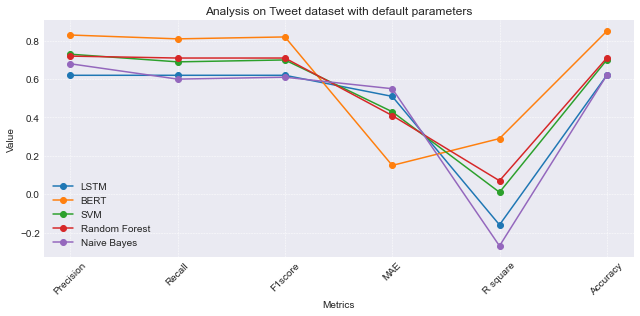

# Comparative Analysis of Sentiment Detection Models Across Amazon Reviews, Tweets, and News

## Project Overview

In today's digital age, understanding the emotions and opinions expressed in written text is crucial for various applications, from predicting stock market trends to enhancing customer satisfaction. This project delves into the intricate world of sentiment analysis, comparing the performance of various machine learning and deep learning models across three distinct text domains: Amazon reviews, Twitter posts, and news articles. By meticulously evaluating these models, we aim to provide a comprehensive guide for selecting the most suitable sentiment analysis model based on the type of text data being analyzed. This study not only measures the performance of different methods but also explores their capabilities and limitations in understanding human emotions, addressing challenges such as sarcasm, uncertainty, and conflicting feelings.

## Table of Contents

1. [Introduction](#introduction)
2. [Literature Review](#literature-review)
3. [Methodology](#methodology)
   - [Purpose of the Study](#purpose-of-the-study)
   - [Dataset Information](#dataset-information)
   - [Data Pre-processing](#data-pre-processing)
   - [Machine Learning Models Used](#machine-learning-models-used)
4. [Implementation](#implementation)
   - [General Overview of the Technology](#general-overview-of-the-technology)
   - [Process Followed in Implementation](#process-followed-in-implementation)
5. [Results and Findings](#results-and-findings)
   - [Metrics Used for Evaluation](#metrics-used-for-evaluation)
   - [Analysis on Tweets Dataset](#analysis-on-tweets-dataset)
   - [Analysis on Amazon Dataset](#analysis-on-amazon-dataset)
   - [Analysis on News Dataset](#analysis-on-news-dataset)
6. [Conclusion](#conclusion)
7. [Datasets Links](#Dataset-Links)

## Introduction

In today's world, written communication has become essential for sharing information and expressing opinions. From social media posts to news articles, understanding the complex emotions and viewpoints expressed in these texts can be challenging. Sentiment analysis, also known as opinion mining, is a powerful tool that helps us understand the emotions expressed in large volumes of text using machine learning techniques. This project aims to thoroughly study sentiment analysis using three different types of texts: Amazon reviews, Twitter posts, and news articles. By analyzing these datasets, we aim to find the best models for understanding people's feelings in different contexts and provide a step-by-step guide for choosing the right sentiment analysis model based on the type of text data being analyzed.

## Literature Review

In recent years, researchers have made significant strides in merging deep learning and machine learning techniques to ensure accurate sentiment classification. This section includes a list of relevant studies that have contributed to the field of sentiment analysis, highlighting the use of various models and techniques to determine user opinions, feelings, and reviews towards different subjects and items.

## Methodology

### Purpose of the Study

The main goal of this research is to carefully study and evaluate how well different machine learning and deep learning models work for sentiment analysis. We are currently looking into three different sources of text data: Amazon Reviews, Twitter, and news stories. The main goal is to figure out which sentiment analysis model works best for each different source in a specific context.

### Dataset Information

- **Amazon Reviews**: Spanning 18 years and including around 35 million reviews up to March 2013. The dataset includes ratings, product information, and plaintext reviews.
- **News Articles**: Perspectives of retail investors regarding the sentiments expressed in financial news headlines.
- **Twitter Data**: Rows containing the text of tweets and a label indicating their sentiment.

### Data Pre-processing

Before analyzing the data, we need to prepare it through several steps, including removing stopwords, stemming, lemmatization, and feature extraction. This process ensures that the text is in a consistent format and ready for analysis.

### Machine Learning Models Used

Our research strategy involves carefully learning and testing various machine learning and deep learning models, including:
- Support Vector Machines (SVM)
- Naive Bayes
- Random Forests
- Long Short-Term Memory (LSTM)
- Bidirectional Encoder Representations from Transformers (BERT)

## Implementation

### General Overview of the Technology

Python was selected as the primary language for this project due to its adaptability and extensive collection of libraries geared towards machine learning and data research. Key libraries used include Pandas, NumPy, Scikit-learn, NLTK, SpaCy, Keras, TensorFlow, and HuggingFace’s Transformers.

### Process Followed in Implementation

1. **Importing Libraries**: Accessing functions and classes needed for the machine learning process.
2. **Loading Dataset**: Loading the dataset into a pandas DataFrame.
3. **Cleaning and Updating Column Names**: Removing null values, correcting typos, and standardizing data types.
4. **Preprocessing the Dataset**: Removing stopwords, stemming, lemmatization, and feature extraction.
5. **Implementing Machine Learning Models**: Using libraries like Scikit-learn or TensorFlow.
6. **Tuning Parameters**: Adjusting parameters to improve model accuracy.
7. **Measuring Accuracy**: Using different accuracy metrics to measure results.
8. **Generating Graphs**: Visualizing the performance of the models.

## Results and Findings

### Metrics Used for Evaluation

- **Precision**: Ratio of accurate positive predictions to the total number of positive predictions.
- **Recall**: Measures the number of accurate positive predictions out of the total number of real positives.
- **F1 Score**: Harmonic mean of both precision and recall.
- **Mean Absolute Error (MAE)**: Average of the absolute discrepancies between predicted and actual values.
- **R square**: Indicates the proportion of the variation in the dependent variable that can be attributed to the independent variables.
- **Accuracy**: Fraction of correct predictions out of the total number of forecasts.

### Analysis on Tweets Dataset

- **Default Parameters**: BERT outperformed other models with a precision of 0.83 and an accuracy of 0.85. 
- **Parameter Changes**: BERT maintained its lead with a precision of 0.79 and an accuracy of 0.83. 

### Analysis on Amazon Dataset

- **Default Parameters**: SVM and Random Forest performed well with an accuracy of 0.83 and 0.81, respectively.
- **Parameter Changes**: BERT continued to excel with an accuracy of 0.81.

### Analysis on News Dataset

- **Default Parameters**: BERT outperformed other models with a precision of 0.76 and an accuracy of 0.80.
- **Parameter Changes**: BERT maintained its lead with a precision of 0.80 and an accuracy of 0.81.

## Conclusion

This in-depth research into sentiment analysis has yielded valuable insights into the capabilities and limitations of various machine learning models across three significant text domains: Tweets, Amazon reviews, and News Articles. BERT consistently exhibited outstanding performance, leveraging its extensive pre-training and bidirectional architecture to effectively extract semantics, particularly from lengthy news articles and nuanced tweets. However, no model emerged as a clear victor across all datasets, indicating room for improvement. The study highlights the importance of matching models to datasets based on their unique characteristics and emphasizes the need for ongoing development to address challenges such as sarcasm, conflicting sentiments, and transfer learning across domains.

## Dataset Links

1. Amazon reviews https://www.kaggle.com/datasets/kritanjalijain/amazon-reviews
2. Sentiment Analysis for Financial News https://www.kaggle.com/datasets/ankurzing/sentiment-analysis-for-financial-news
3. Twitter Tweets Sentiment Dataset https://www.kaggle.com/datasets/yasserh/twitter-tweets-sentiment-dataset

